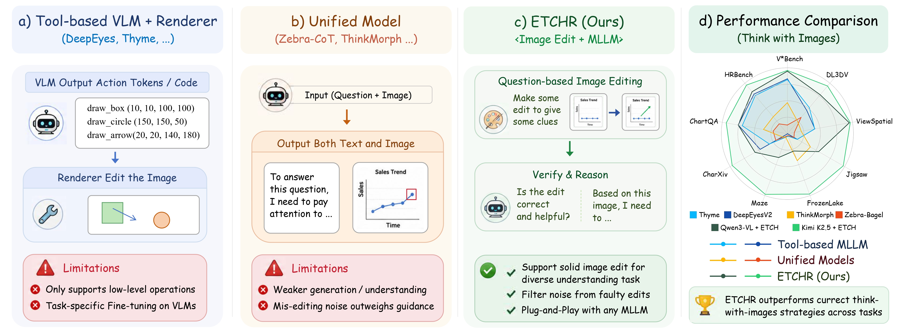
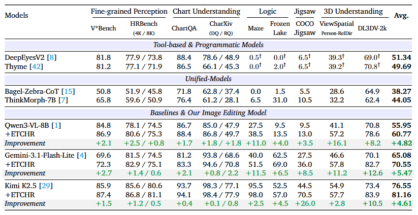
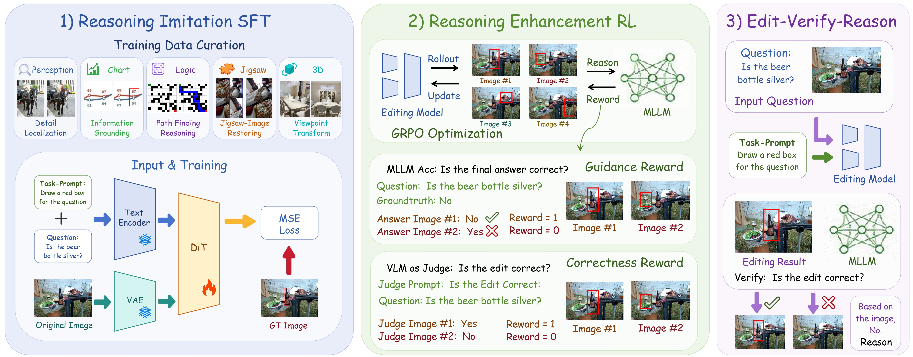
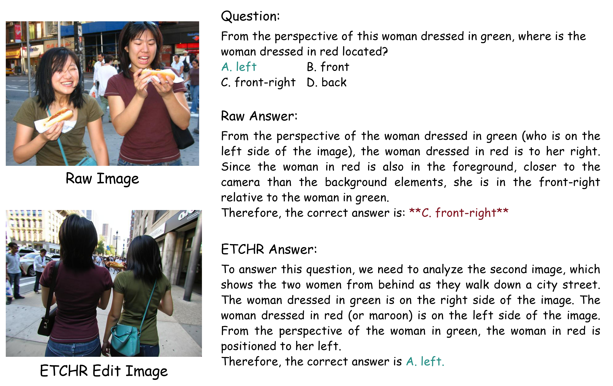
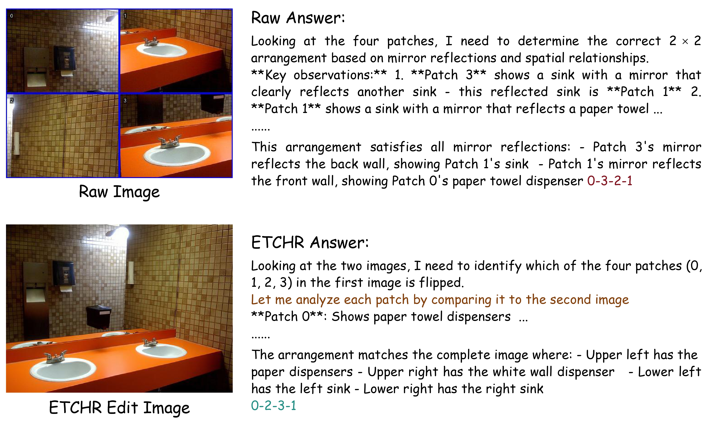
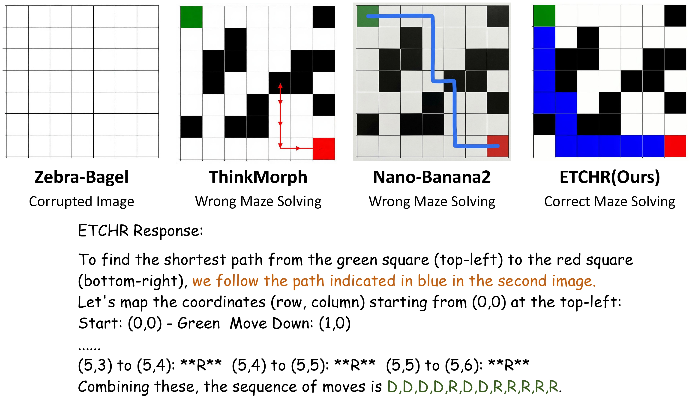
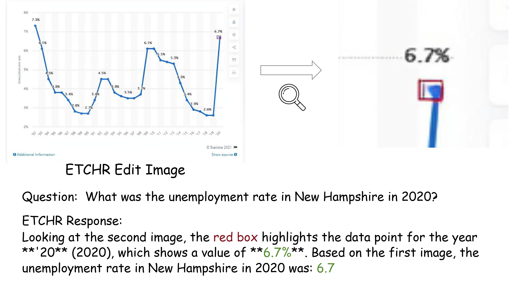

<div align="center">
  <h1 align="center">
    <div style="display: flex; align-items: center; justify-content: center;">
      <div style="text-align: left; line-height: 1.3;">
        ETCHR: Editing To Clarify and Harness Reasoning
      </div>
    </div>
  </h1>
  <p align="center">
    <a href="https://beichenzbc.github.io/"><strong>Beichen Zhang<sup>&ast;</sup></strong></a >
    ·
    <a href="https://scholar.google.com/citations?hl=en&user=yQ8U3tUAAAAJ"><strong>Yuhong Liu<sup>&ast;</sup></strong></a >
    ·
    <a href="https://github.com/Li-Jinsong"><strong>Jinsong Li</strong></a >
    ·
    <a href="https://yuhangzang.github.io/"><strong>Yuhang Zang<sup>&dagger;</sup></strong></a >
    ·
    <a href="https://myownskyw7.github.io/"><strong>Jiaqi Wang<sup>&dagger;</sup></strong></a >
    ·
    <a href="http://dahua.site/"><strong>Dahua Lin<sup>&dagger;</sup></strong></a >
  </p >
  <p align="center" style="font-size: 1em; margin-top: -1em"> <sup>&ast;</sup>Equal Contribution  <sup>&dagger;</sup>Corresponding authors. </p >
  <p align="center" style="font-size: 1.2em; margin-top: 0.5em">
    📖<a href="https://arxiv.org/abs/">Paper</a>
  | 🏠<a href="https://github.com/InternLM/ETCHR">Homepage</a >
  | 🤗<a href="https://huggingface.co/internlm/ETCHR-FLUX.2-klein-9B">ETCHR-FLUX.2-klein-9B Model</a >
  | 🤗<a href="https://huggingface.co/datasets/BeichenZhang/ETCHR-SFT-400K">ETCHR SFT-400K Dataset</a >
  | 🤗<a href="https://huggingface.co/datasets/internlm/ETCHR-GRPO-10K">ETCHR GRPO-10K Dataset</a >
  | 🤗<a href="https://huggingface.co/datasets/internlm/DL3DV-2k">DL3DV-2K Benchmark</a >
  </p > 
</div>

## 📢 News
- 🚀 [2026/05/24] We have released the training and evaluation code of ETCHR.
- 🚀 [2026/05/21] We have released the [ETCHR-FLUX.2-klein-9B Model](https://huggingface.co/internlm/ETCHR-FLUX.2-klein-9B), [ETCHR-SFT-400K Dataset](https://huggingface.co/datasets/BeichenZhang/ETCHR-SFT-400K) and [ETCHR GRPO-10K Dataset](https://huggingface.co/datasets/internlm/ETCHR-GRPO-10K).

  
## 🌈 Overview
We are thrilled to introduce ETCHR (Editing To Clarify and Harness Reasoning), a novel question-conditioned, reasoning-aware image editor designed to serve as a decoupled visual reasoning assistant for Multimodal Large Language Models (MLLMs).

By decoupling the specialized image editor from the downstream understanding model, ETCHR bridges the critical bottleneck where a purely textual chain of thought fails in fine-grained focus or complex spatial transformations.

</p>
<p style="text-align: center;"> 
   
</p>


## 💡 Highlights
- 🔥 **Decoupled & Plug-and-Play:** ETCHR functions as a separate module, allowing it to assist diverse downstream MLLMs (such as Qwen3-VL-8B, Gemini-3.1-Flash-Lite, or Kimi K2.5) without requiring any task-specific fine-tuning on the understanding models themselves.
- 🔥 **Naturally Reflective Pipeline:** Introduces an Edit-Verify-Reason inference mechanism where the understanding model filters out noisy or flawed edits, reverting safely to the original image when verification fails.

## 📊 Results
We evaluate ETCHR across five distinct task families spanning fine-grained perception, chart understanding, logic reasoning, jigsaw restoration, and 3D understanding. Across all evaluated backbones, ETCHR consistently yields major improvements in Pass@1 accuracy:
<p style="text-align: center;"> 
   
</p>

## 🛠️ Evaluation
Prepare your environment:
```bash
git clone https://github.com/InternLM/ETCHR.git
conda create -n ETCHR python==3.11
conda activate ETCHR
cd RL/Pref-GRPO
bash env_setup.sh fastvideo
pip install "vllm>=0.11.0"
pip install qwen-vl-utils==0.0.14
```

We Provide an example code running ETCHR on [DL3DV-2K Benchmark](https://huggingface.co/datasets/internlm/DL3DV-2k) in ```Evaluation/inference_dl3dv.py```, you can start the evaluation with the following two steps:

**Step 1:** start a VLLM server for an understanding model (eg. Qwen3-VL-8B, Kimi K2.5, ...).
```bash
cd Evaluation
bash launch_vllm.sh
```

**Step 2:** Run ETCHR atop any understanding model
```bash
python inference_dl3dv.py
```

## 🛠️ Training
We adopt a two-stage Training Pipeline.
See <a href="https://github.com/InternLM/ETCHR/blob/main/SFT/SFT.md">SFT.md</a > and <a href="https://github.com/InternLM/ETCHR/blob/main/RL/RL.md">RL.md</a > for further details.

<p style="text-align: center;"> 
   
</p>


## Cases
ETCHR can assist with a broad spectrum of understanding tasks, including fine-grained perception, chart reasoning, maze navigation, jigsaw puzzles, and 3D spatial understanding.

<p style="text-align: center;"> 
   
</p>
<p style="text-align: center;"> 
   
</p>
<p style="text-align: center;"> 
   
</p>
<p style="text-align: center;"> 
   
</p>

## ✒️Citation
If you find this project useful, please kindly cite:
```
@article{zhang2026etchr,
  title={ETCHR: Editing To Clarify and Harness Reasoning},
  author={Beichen Zhang, Yuhong Liu, Jinsong Li, Yuhang Zang, Jiaqi Wang, Dahua Lin},
  journal={arXiv preprint arXiv:2605.23897},
  year={2026}
}
```

## 📄 License
Our work is based on [FLUX.2-klein-base-9B](https://huggingface.co/black-forest-labs/FLUX.2-klein-base-9B), so please follow [FLUX Non-Commercial License](https://github.com/black-forest-labs/flux2/blob/main/model_licenses/LICENSE-FLUX-NON-COMMERICAL).


## ❤️ Acknowledgement

The work is built upon <a href="https://github.com/modelscope/DiffSynth-Studio">DiffSynth-Studio</a > and <a href="https://github.com/CodeGoat24/Pref-GRPO">Pref-GRPO</a >, two excellent codebases for Diffusion models training!
